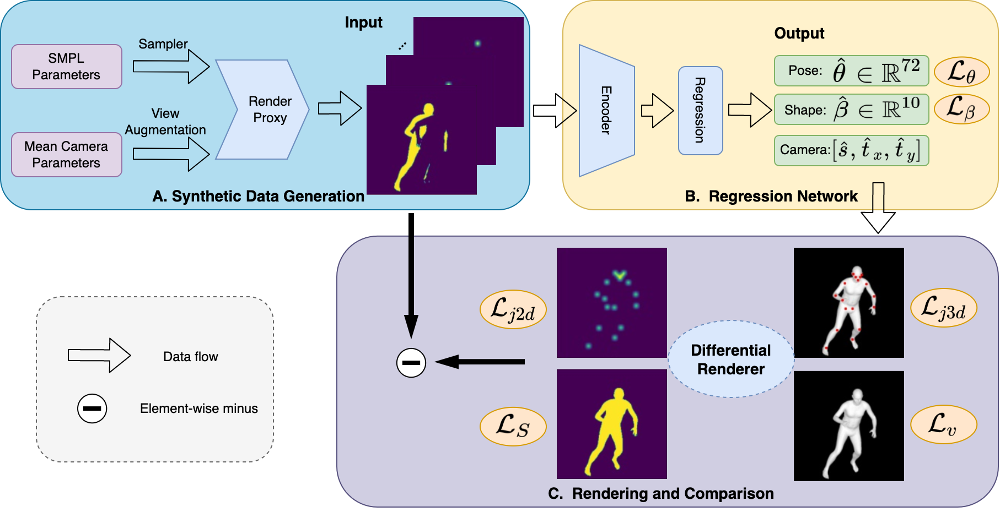

# LASOR: Learning Accurate 3D Human Pose and Shape Via Synthetic Occlusion-Aware Data and Neural Mesh Rendering

Code repository for the paper:  
**LASOR: Learning Accurate 3D Human Pose and Shape Via Synthetic Occlusion-Aware Data and Neural Mesh Rendering**  
Kaibing Yang; Renshu Gu; Maoyu Wang; Masahiro Toyoura; Gang Xu

IEEE Transactions on Image Processing 2022
[[paper](https://ieeexplore.ieee.org/document/9709705)]




### Requirements
- Linux or macOS
- Python ≥ 3.6

### Instructions
We recommend using a virtual environment to install relevant dependencies:
```
python3 -m venv LASOR
source LASOR/bin/activate
```
After creating a virtual environment, first install torch and torchvision: `pip install torch==1.4.0 torchvision==0.5.0`

Then install detectron2 and its dependencies (cython and pycocotools):
```
pip install cython
pip install 'git+https://github.com/cocodataset/cocoapi.git#subdirectory=PythonAPI'
pip install 'git+https://github.com/akashsengupta1997/detectron2.git'
```

The remaining dependencies can be installed by simply running: `pip install -r requirements.txt`. This will be sufficient for inference. If you wish run model training, you will require the PyTorch port of Neural Mesh Renderer: `pip install neural_renderer_pytorch==1.1.3`.

### Additional files
You will need to download the SMPL model. The [neutral model](http://smplify.is.tue.mpg.de) is required for training and running the demo code. If you want to evaluate the model on datasets with gendered SMPL labels (such as 3DPW and SSP-3D), the male and female models are available [here](http://smpl.is.tue.mpg.de). You will need to convert the SMPL model files to be compatible with python3 by removing any chumpy objects. To do so, please follow the instructions [here](https://github.com/vchoutas/smplx/tree/master/tools).

Download the required additional files [here](https://drive.google.com/drive/folders/1phJix1Fp-AbJgoLImb19eXCWEK7ZnAp_?usp=sharing). Place both the SMPL model and the additional files in the `additional` directory such that they have the following structure and filenames:

    LASOR
    ├── additional                                # Folder with additional files
    │   ├── smpl
    │       ├── SMPL_NEUTRAL.pkl                  # Gender-neutral SMPL model 
    │   ├── cocoplus_regressor.npy                # Cocoplus joints regressor
    │   ├── J_regressor_h36m.npy                  # Human3.6M joints regressor
    │   ├── J_regressor_extra.npy                 # Extra joints regressor
    │   ├── neutral_smpl_mean_params_6dpose.npz   # Mean gender-neutral SMPL parameters
    │   ├── smpl_faces.npy                        # SMPL mesh faces
    │   ├── cube_parts.npy
    │   └── vertex_texture.npy                    
    └── ...

### Model checkpoints
Download pre-trained model checkpoints [here](https://drive.google.com/file/d/1xKM8PRhc3TbZVKig9kULJ01-VVWUkICi/view?usp=sharing) for our SMPL regressor, as well as for PointRend and DensePose (via detectron2) from [here](https://drive.google.com/drive/folders/1QX5NBR6GgmfP206bMHN9ZgK8_1QEKSdg?usp=sharing). Place these files in the `checkpoints` directory.

### Training data
We use the training data from [here](https://drive.google.com/drive/folders/1CLOqQBrTos7vhohjFcU2OFkNYmyvQf6t?usp=sharing) provided by STRAPS. Place these files in the `data` directory.

## Inference
`run_predict.py` is used to run inference on a given folder of input images. For example, to run inference on the demo folder, do:
```
python run_predict.py --input ./demo --checkpoint checkpoints/LASOR.tar --silh_from pointrend
```
You can choose between using `--silh_from pointrend` and `--silh_from densepose`  to obtain human silhouettes. PointRend provides more accurate silhouettes for easy body poses but DensePose is more robust to challenging body poses. Best results are achieved when the image is roughly cropped and centred around the subject person.

If you are running inference on a remote machine, you might run into problems getting `pyrender` to run off-screen/headless rendering. If you have EGL installed, uncommenting the appropriate line in `run_predict.py` might work. If not, simply disable pyrender rendering during inference.


## Citations

If you find this code useful in your research, please cite the following publication:
```
@ARTICLE{9709705,  
  author={Yang, Kaibing and Gu, Renshu and Wang, Maoyu and Toyoura, Masahiro and Xu, Gang},  
  journal={IEEE Transactions on Image Processing},   
  title={LASOR: Learning Accurate 3D Human Pose and Shape via Synthetic Occlusion-Aware Data and Neural Mesh Rendering},   
  year={2022},  
  volume={31},  
  number={},  
  pages={1938-1948},  
  doi={10.1109/TIP.2022.3149229}
}
```


## Acknowledgments
Code was adapted from/influenced by the following repos - thanks to the authors!
- [STRAPS](https://github.com/akashsengupta1997/STRAPS-3DHumanShapePose)
- [HMR](https://github.com/akanazawa/hmr)
- [SPIN](https://github.com/nkolot/SPIN)
- [VIBE](https://github.com/mkocabas/VIBE)
- [detectron2](https://github.com/facebookresearch/detectron2)
- [NMR PyTorch](https://github.com/daniilidis-group/neural_renderer)
